<h2 align="center">A French 🛠️ Soft, 🌐 Front and 🧭 DevOps developer</h2>

Hi 👋, I'm a French developer, I'm 16 years old and I'm currently in high school. I'm a developer in the 🛠️ Soft, 🌐 Front and 🧭 DevOps fields

I'm currently working on my own projects, but I'm also a member of the Hyriode (https://hyriode.fr) team.

 

  
  
  

  <a href="https://github.com/nullptr-rs/nullptr-rs/issues/new?assignees=&labels=bug&template=BUG_REPORT.md&title=bug%3A+">Report a Bug</a>
  ·
  <a href="https://github.com/nullptr-rs/nullptr-rs/discussions/new?assignees=&labels=enhancement&title=feat%3A+">Request a Feature</a>
  ·
  <a href="https://github.com/nullptr-rs/nullptr-rs/discussions/new?assignees=&labels=help%20wanted&title=ask%3A+">Ask a Question</a>

---

  

# 📚 About me

I love programming, but also learning new technologies, languages, etc. I always try to learn new things, so I'm open to new ideas and projects, and above all to difficult challenges. 
I started programming actively in 2019, with a lot of Minecraft projects, but I also did some other projects, such as Discord bots, simple websites, etc. 
The JetBrains IDEs are my best friends, I use them every day. I also use Visual Studio Code, but I don't like it as much as CLion or IntelliJ IDEA.

# 📫 Contact
- 📭 Discord: `nullptr-rs#6086`
- ✉️Email: `nullptr.rs@gmail.com`

# 💻 Technologies

## 🛠️ Software and 🌐 Front development
- I love ❤️: 
  -  Rust
  -  C++
  - 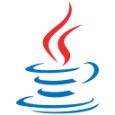 Java (With  Gradle)
  - 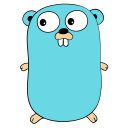 Golang
  -  VueJS (With the 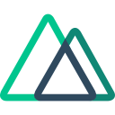 NuxtJS framework)
  
- I'm currently learning 📖:
  -  C
  - 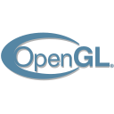 OpenGL
  - 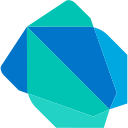 Dart
  -  Flutter
  - 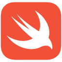 Swift

  
- I have tried, but I'm not a fan of 🤔:
  -  Javascript 
  -  C#
  -  Python
  - 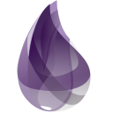 Elixir
  - 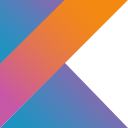 Kotlin

## 📦 Databases and 🔌 APIs
- I love ❤️:
  -  MongoDB
  - 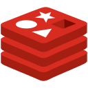 Redis
  - 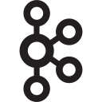 Kafka

- I have tried, but I'm not a fan of 🤔:
  - 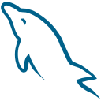 MySQL

## 🛠️ Tools
- I love ❤️:
  -  Git
  -  Github
  - 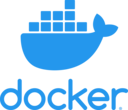 Docker
  -  Kubernetes
- I'm currently learning 📖:
  -  Grafana
  - 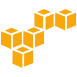 Amazon Web Services
  -  Azure
  
  
# 📊 Stats

